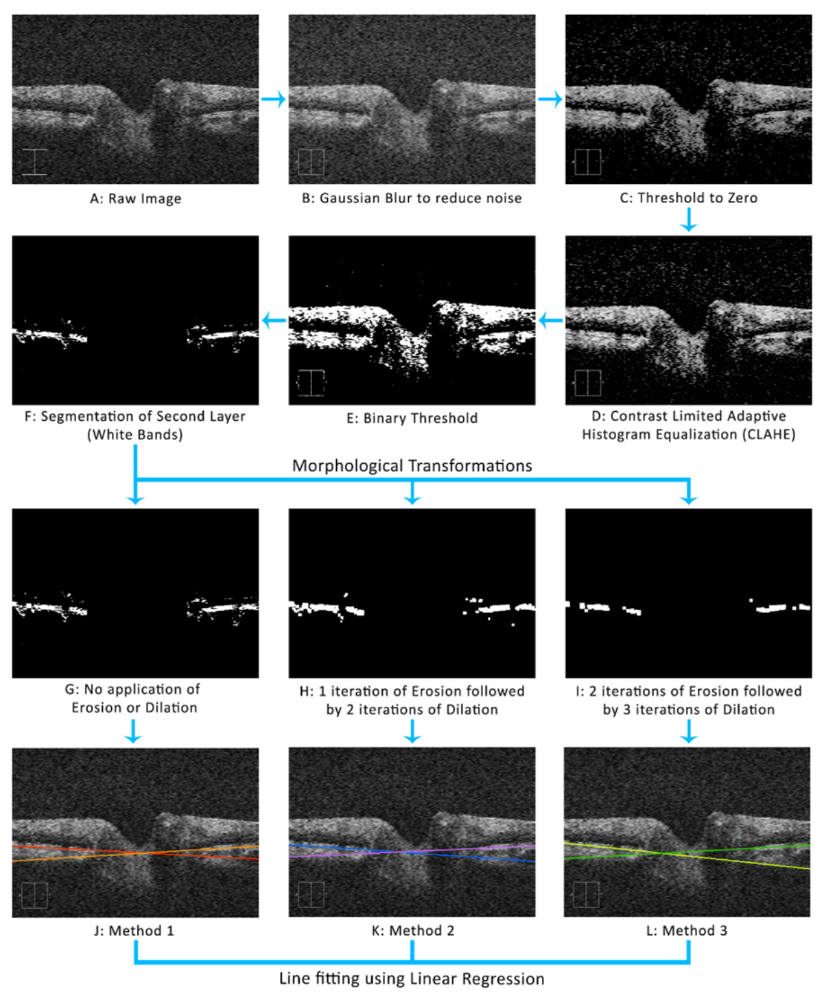

# OpticDisc-TiltAngle

Optic disc tilt (ODT), peripapillary atrophy (PPA), and abnormally large or small optic discs are the earliest known changes in myopic eyes and may precede the development of pathological myopia. Increasing ODT and distance between the macula and optic nerve head have been reported as being associated with progressive myopia. Therefore, it is important to segment and quantify the ODT accurately. Using a newly developed automated image processing method we measured the ODT in both myopes and emmetropes. We determined the ODT from myopic eyes (n= 90) and compared the results with emmetropia (n=14). All 104 optical coherence tomography (OCT) images had dimensions of 200x200 pixels corresponding to 6mm x 6mm. The myopic OCT images were labeled based on a severity scale based on the spherical error (SE) as low (-0.5 to -3.00 D SE), moderate (-3.12 to -6.00 D SE), high (-6.12 to -9.00 D SE), and very high (worse than -9.00 D SE) using standard myopia classifications. Each OCT image was segmented by a clinician (CEM) and by the newly proposed method (NAM). The NAM used 8-bit grayscale OCT images which was preprocessed by applying Gaussian blur and Contrast Limited Adaptive Histogram Equalization based thresholding to remove noise and locate regions of interest. Then the images were split into two halves to fit straight lines separately. Morphological erosion and dilation were performed on the images to remove artifacts. They were tested with three combinations of erosion and dilation iterations. Univariate linear regression Lines were fit to trace the white band on each half and angle between the lines was determined. Both the methods showed higher horizontal ODT than vertical. The mean ± SD horizontal ODT (in degrees) in the myopic eye was 18.47 ± 7.67 and 15.84± 6.61 by the NAM and CEM methods. The vertical ODT in the myopic eyes (in degrees) was 16.32 ± 7.10, and 14.52 ± 7.05 by the NAM and CEM methods respectively. However, the NAM showed a maximum difference (2.26 ± 5.68) between horizontal and vertical ODT. The study results show that the ODT in very high myopic eyes (26.33±8.99)is significantly different (p<0.05) when compared to emmetropic eyes (19.47±3.99).

## Methods

